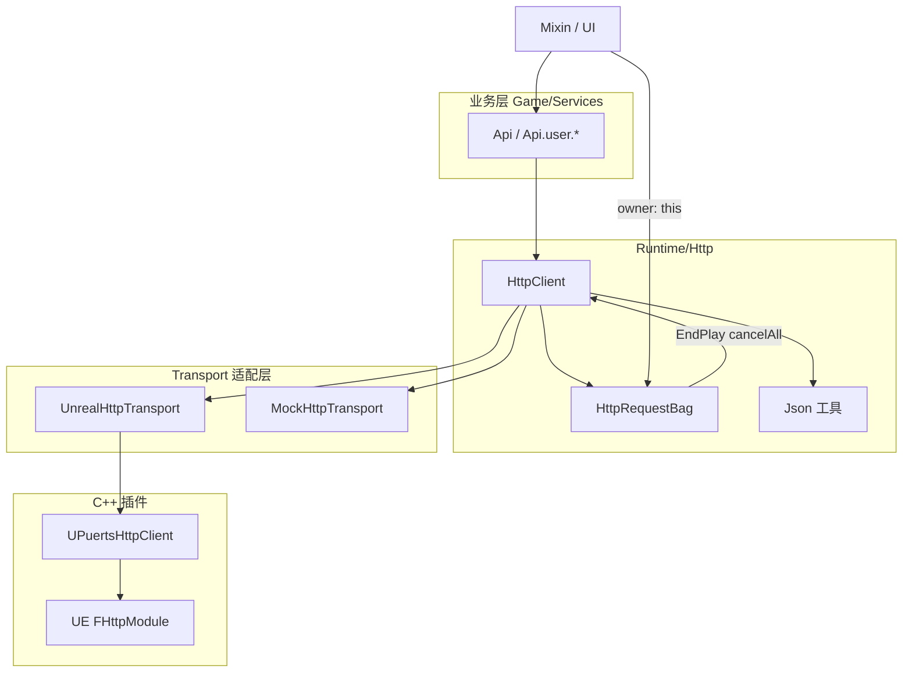
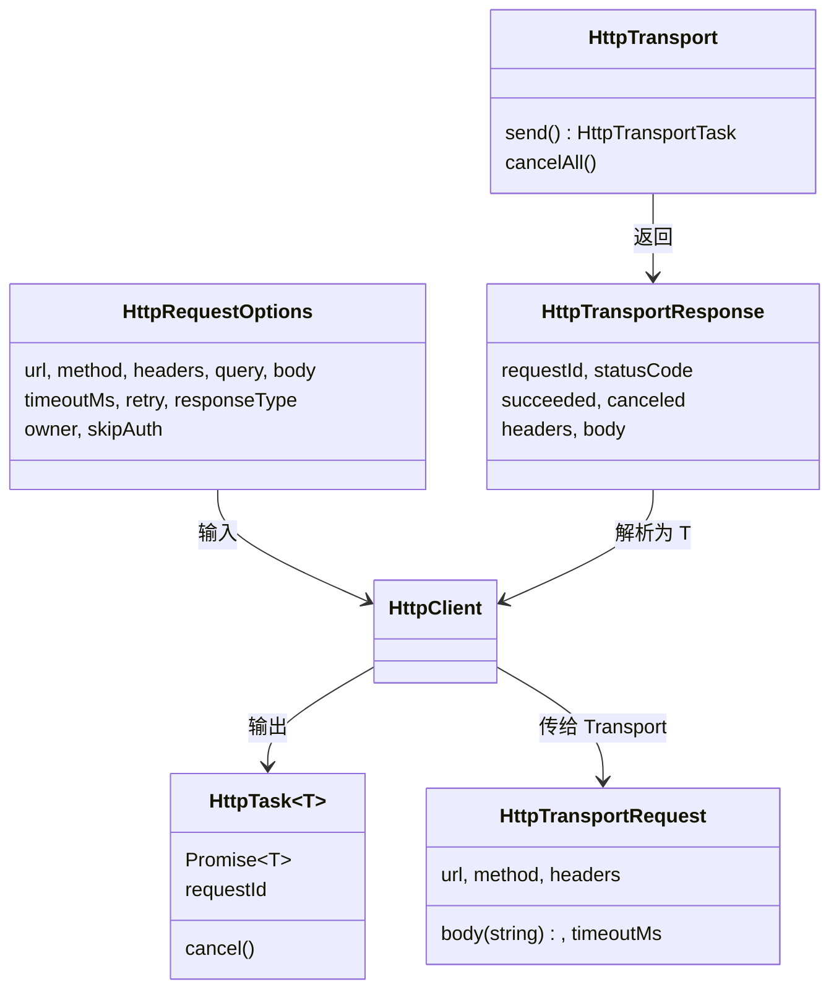
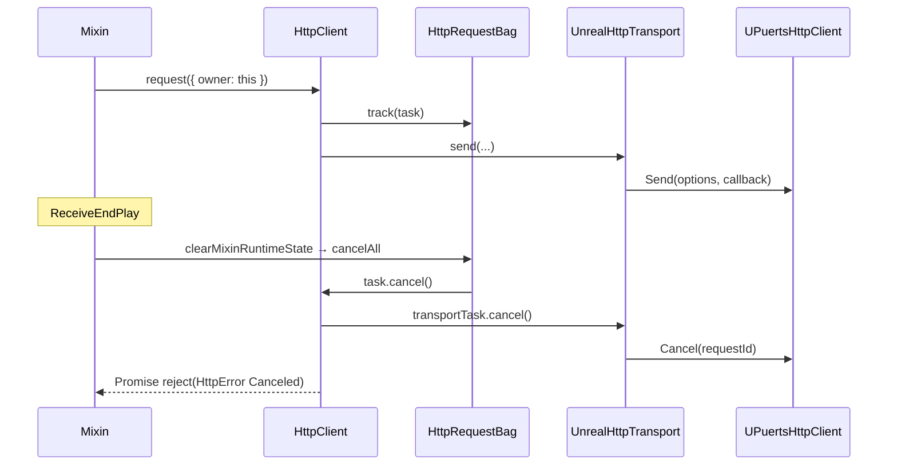

# HTTP 请求框架

本文档说明项目 HTTP 调用的分层架构、请求生命周期、配置与扩展方式。Mixin / UI 日常开发只需阅读 [使用规范](#使用规范) 与 [推荐用法](#推荐用法); 需要改 Transport 或 HttpClient 时再查阅后续章节。

---

## 架构概览

项目采用**四层分离**设计: 业务层只关心「调哪个 API、传什么参数」, 传输细节、鉴权、重试、生命周期管理逐层下沉。

```text
Mixin / UI / Gameplay
        -> Game/Services/Api
        -> Runtime/Http/HttpClient
        -> Runtime/Http/UnrealHttpTransport  (或 MockHttpTransport)
        -> Plugins/PuertsHttpTransport (UPuertsHttpClient -> UE FHttpModule)
```



**核心原则**: C++ 只做传输原语, TypeScript 做策略, Game 层做业务语义。

### 分层职责

| 层级 | 位置 | 职责 | 不应做的事 |
|------|------|------|-----------|
| 业务 API | `Game/Services/Api.ts` | 领域接口封装、懒初始化、模块生命周期 | 拼完整 URL、直接调 UE HTTP |
| HTTP 客户端 | `Runtime/Http/HttpClient.ts` | baseUrl 拼接、Header 合并、Bearer 注入、重试、响应解析、错误分类 | 感知具体后端业务 |
| Transport | `UnrealHttpTransport` / `MockHttpTransport` | 把统一请求/响应格式映射到具体实现 | 鉴权、重试、2xx 判断 |
| C++ 桥接 | `Plugins/PuertsHttpTransport` | 封装 `FHttpModule`, 管理 RequestId 与 Cancel | baseUrl、token、业务错误码 |

---

## 使用规范

Mixin 中优先调用业务 API, 不直接拼接后端域名, 不直接访问 `UnrealHttpTransport` 或插件 UObject。

```typescript
import { Api } from '../../../Game/Services';

async TS_LoadUserProfile(): Promise<void> {
    const profile = await Api.user.getProfile({ owner: this });
    this.BP_UpdateUserName(profile.name);
}
```

- 传入 `owner: this` 后, 请求会登记到当前 Mixin 的 `HttpRequestBag`。`ReceiveEndPlay` 中调用 `clearMixinRuntimeState(this)` 时, 未完成请求会自动取消, 避免对象销毁后继续回调蓝图或 UE 对象。
- 认证 token 通过 `Api.setBearerTokenProvider()` 动态提供, **不写入** `Config` 或源码常量。
- `Config.http` 只保存 `baseUrl`、超时、默认 headers 和重试默认值。

---

## 请求生命周期

以 `Api.user.getProfile({ owner: this })` 为例:

### 1. 业务入口 (Api)

`Api.init()` 懒创建 `HttpClient`, 注入 `Config.http` 中的 `baseUrl`、`timeoutMs`、`defaultHeaders`、`retry`, 默认 Transport 为 `UnrealHttpTransport`。

领域方法只做路径与类型映射, 例如:

```typescript
getProfile: (options) => this.get<UserProfileDto>('/users/me', options)
```

### 2. HttpClient.request()

1. `buildUrl(baseUrl, url, query)` 拼接完整 URL (绝对 `http(s)://` URL 忽略 baseUrl)
2. 返回 `HttpTask<T>`: 本质是 `Promise<T>` + `requestId` + `cancel()`
3. 若传入 `owner`, 任务登记到 `getMixinRuntimeState(owner).requests`

`requestId` 通过 getter 延迟读取, 因为 Transport 在 `send()` 返回后才分配 id。

### 3. runRequest 执行循环

每次 attempt:

| 步骤 | 函数 | 说明 |
|------|------|------|
| 合并 Header | `createHeaders` | `defaultHeaders` + 请求 Header + `Authorization: Bearer ...` |
| 序列化 Body | `serializeBody` | 对象自动 `JSON.stringify`, 并补 `Content-Type: application/json` |
| 发送 | `transport.send()` | 返回 `HttpTransportTask` |
| 处理响应 | `handleResponse` | 区分 Transport 失败 / 非 2xx / 成功, 并解析 body |

失败时: 401 可触发 token 刷新 (不消耗重试次数); 否则按策略重试并指数退避。

### 4. UnrealHttpTransport → C++

TS 层 `HttpTransportRequest` 映射为 C++ `FPuertsHttpRequestOptions`:

| HttpTransportRequest | FPuertsHttpRequestOptions |
|----------------------|---------------------------|
| `url` (完整 URL) | `Url` |
| `method` | `Verb` |
| `headers` (对象) | `HeadersJson` (JSON 字符串) |
| `body` (字符串) | `Body` |
| `timeoutMs` | `TimeoutSeconds` (毫秒 → 秒) |

C++ `UPuertsHttpClient::Send` 解析 HeadersJson、调用 `FHttpModule::ProcessRequest`, 异步完成后回调 TS。成功排队返回正数 `RequestId`, 失败返回 `0` 并同步触发错误 Callback。

### 5. 响应与错误

`handleResponse` 判断顺序:

```text
response.canceled        → HttpError (kind: Canceled)
!response.succeeded      → HttpError (kind: Transport)   // 网络层失败
statusCode 不在 [200,300) → HttpError (kind: StatusCode) // HTTP 语义错误
否则                     → parseResponseBody<T>()
```

**注意**: C++ 层 `bSucceeded` 表示网络层是否收到响应; HTTP 4xx/5xx 时仍可能为 `true`。2xx 判断在 `HttpClient` 中完成。

---

## 类型体系



**两层 Promise 模型**:

- `HttpTransportTask`: Transport 层, resolve 为原始 `HttpTransportResponse`
- `HttpTask<T>`: HttpClient 层, resolve 为解析后的业务类型 `T`

Transport 可替换 (Unreal / Mock), 上层 API 不变。

### HttpError 分类

| kind | 含义 | 是否重试 |
|------|------|---------|
| `Transport` | 网络/插件层失败 | 默认重试 |
| `StatusCode` | 收到响应但非 2xx | 仅配置中的状态码重试 |
| `Canceled` | 主动 cancel 或 owner 销毁 | 否 |
| `Parse` | JSON 解析失败 | 否 |

错误对象携带 `requestId`、`method`、`url`、`statusCode`、`responseBody`, 便于日志与业务层解析服务端错误详情。

---

## 重试策略

默认与 `Config.http.retry` 一致:

```typescript
attempts: 1                    // 默认不重试 (attempts=1 即只尝试一次)
baseDelayMs: 250
maxDelayMs: 2000
retryMethods: ['GET', 'HEAD']   // POST/PUT 默认不重试, 防重复提交
retryStatusCodes: [408, 429, 500, 502, 503, 504]
```

`shouldRetry` 规则:

1. 已达 `attempts` 上限 → 不重试
2. 方法不在 `retryMethods` → 不重试
3. `Canceled` / `Parse` → 不重试
4. `Transport` → 重试
5. `StatusCode` → 仅 `retryStatusCodes` 中的状态码重试

退避: `delay = min(baseDelayMs × 2^(attempt-1), maxDelayMs)`

单次请求可覆盖: `retry: false` 禁用; `retry: { attempts: 3 }` 局部调整。

---

## 鉴权 (Bearer Token)

```typescript
Api.setBearerTokenProvider(() => getAccessToken());

Api.setBearerTokenRefreshHandler(async () => {
    const ok = await refreshToken();
    return ok;
});
```

流程:

1. 每次请求前 `bearerTokenProvider()` 取 token, 非空则加 `Authorization: Bearer ...`
2. 收到 **401** 且本请求尚未刷新过 → 调用 `bearerTokenRefreshHandler()`
3. 刷新成功 → 用新 token 重发同一请求 (**不消耗** retry attempt)
4. 每个请求最多刷新 **一次**, 避免 401 死循环
5. `skipAuth: true` 跳过注入与 401 刷新 (如公开接口)

---

## 取消与生命周期



三层 cancel 链路:

1. **`HttpTask.cancel()`** → 调 Transport cancel → reject 为 `HttpError.canceled`
2. **`UnrealHttpTransport.cancel()`** → `UPuertsHttpClient::Cancel` → Unbind + `CancelRequest`, 不再触发 C++ 回调
3. **`HttpRequestBag.cancelAll()`** → EndPlay 时批量 cancel

`HttpRequestBag` 与 `DelegateBag`、`TimerBag` 并列, 纳入 `MixinRuntimeState`:

```typescript
// ReceiveEndPlay
clearMixinRuntimeState(this);
// → delegates.clear() + timers.clearAll() + requests.cancelAll()
```

---

## 响应体解析

`parseResponseBody<T>` (`Runtime/Http/Json.ts`):

| `responseType` | 返回值 |
|----------------|--------|
| `'json'` (默认) | 自动 JSON.parse, 或启发式识别 |
| `'text'` | 原始字符串 |
| `'raw'` | 完整 `HttpTransportResponse` |

默认 JSON 启发式: `Content-Type` 含 `application/json`, 或 body 以 `[` / `{` 开头。空 body 返回 `undefined`。

---

## 配置

```typescript
// config.default.ts — 入库默认值
http: {
    baseUrl: '',
    timeoutMs: 15000,
    defaultHeaders: { Accept: 'application/json' },
    retry: { attempts: 1, baseDelayMs: 250, maxDelayMs: 2000, ... },
}

// config.dev.ts — 本地覆盖 (gitignore, 参考 config.dev.example.ts)
http: {
    baseUrl: 'https://api.example.com',
    ...
}
```

`ApiModule` 在模块注册时 `init()` / `dispose()` 管理 HttpClient 生命周期。

---

## MockHttpTransport (测试 / 离线)

```typescript
import { MockHttpTransport } from '../../Runtime';
import { Api } from '../../Game/Services';

const mock = new MockHttpTransport();
mock.register('GET', 'https://api.example.com/users/me', () => ({
    statusCode: 200,
    succeeded: true,
    canceled: false,
    headers: { 'Content-Type': 'application/json' },
    body: JSON.stringify({ id: '1', name: 'Test' }),
}));

Api.setTransport(mock);
```

- 按 **method + 完整 url** 精确匹配
- `setTimeout(0)` 模拟异步, 与真实 Transport 时序一致
- 未匹配路由 → 404 JSON

---

## 扩展指南

### 新增业务 API

按领域拆文件; 路径集中在同文件顶部 `UserRoutes`, 方法体不内联 path 字面量.

**同域新增接口** — 编辑 `Game/Services/user.api.ts`:

```typescript
const UserRoutes = {
    profile: '/users/me',
    settings: '/users/me/settings',  // 1. 先加 path
} as const;

export interface UserApi {
    getProfile(options?: ApiRequestOptions): HttpTask<UserProfileDto>;
    getSettings(options?: ApiRequestOptions): HttpTask<UserSettingsDto>;  // 2. 再加方法
}

export function createUserApi(deps: ApiHttpDeps): UserApi {
    return {
        getProfile: (options = {}) => deps.get<UserProfileDto>(UserRoutes.profile, options),
        getSettings: (options = {}) => deps.get<UserSettingsDto>(UserRoutes.settings, options),
    };
}
```

**新增领域** — 新建 `inventory.api.ts` 等, 在 `Api.ts` 挂载一行:

```typescript
readonly inventory = createInventoryApi(this);
```

单域 path 超过约 10 条时, 可再拆 `<domain>.routes.ts` (可选升级).

### 新增 Transport 实现

实现 `HttpTransport` 接口:

```typescript
interface HttpTransport {
    send(request: HttpTransportRequest): HttpTransportTask;
    cancelAll?(): void;
}
```

通过 `Api.setTransport(customTransport)` 注入; 会 cancel 旧 Transport 上的未完成请求。

### 错误处理

```typescript
import { HttpError } from '../../Runtime';

try {
    const profile = await Api.user.getProfile({ owner: this });
} catch (error) {
    if (error instanceof HttpError) {
        if (error.kind === 'StatusCode' && error.statusCode === 404) {
            // 用户不存在
        }
        if (error.kind === 'Canceled') {
            // 对象已销毁, 通常可忽略
            return;
        }
        // error.responseBody 可解析服务端错误详情
    }
}
```

---

## 设计决策摘要

1. **Headers 用 JSON 字符串跨 C++/TS 边界** — 避免 `TMap` 在 Puerts 反射与 d.ts 生成中的兼容问题。
2. **`bSucceeded` vs HTTP 状态码** — 网络成功与 HTTP 语义成功分层处理。
3. **`HttpTask.requestId` 用 getter** — Transport 异步启动, id 在 `send()` 返回后才可用。
4. **401 刷新用 `--attempt`** — Token 刷新不算网络重试 attempt。
5. **POST 默认不重试** — 防止非幂等重复提交。
6. **Mixin 状态用稳定 key** — Puerts 可能为同一 UObject 生成不同 JS wrapper, `MixinRuntimeState` 对 UE 对象使用 `GetPathName()`。

---

## 推荐用法

```typescript
import { Api } from '../../../Game/Services';

// 1. 常规业务请求 (Mixin 中)
async TS_LoadUserProfile(): Promise<void> {
    const profile = await Api.user.getProfile({ owner: this });
    this.BP_UpdateUserName(profile.name);
}

// 2. 手动取消
const task = Api.get('/some/path', { owner: this });
task.cancel('User navigated away');

// 3. 跳过鉴权
await Api.get('/public/health', { skipAuth: true, owner: this });

// 4. 自定义重试
await Api.get('/unstable', { retry: { attempts: 3 }, owner: this });

// 5. 原始 Transport 响应
const raw = await Api.get('/file', { responseType: 'raw', owner: this });
```

---

## 相关源码

| 模块 | 路径 |
|------|------|
| HTTP 壳 / 模块生命周期 | `TypeScript/Game/Services/Api.ts` |
| 领域 deps 契约 | `TypeScript/Game/Services/api.deps.ts` |
| 用户域 API (示例) | `TypeScript/Game/Services/user.api.ts` |
| Services 统一导出 | `TypeScript/Game/Services/index.ts` |
| HTTP 客户端 | `TypeScript/Runtime/Http/HttpClient.ts` |
| Transport | `TypeScript/Runtime/Http/UnrealHttpTransport.ts`, `MockHttpTransport.ts` |
| 类型与工具 | `TypeScript/Runtime/Http/types.ts`, `Json.ts`, `HttpError.ts` |
| 生命周期 | `TypeScript/Runtime/Http/HttpRequestBag.ts`, `MixinState.ts` |
| 配置 | `TypeScript/Config/Env/config.default.ts`, `config.dev.example.ts` |
| C++ 插件 | `Plugins/PuertsHttpTransport/` |
